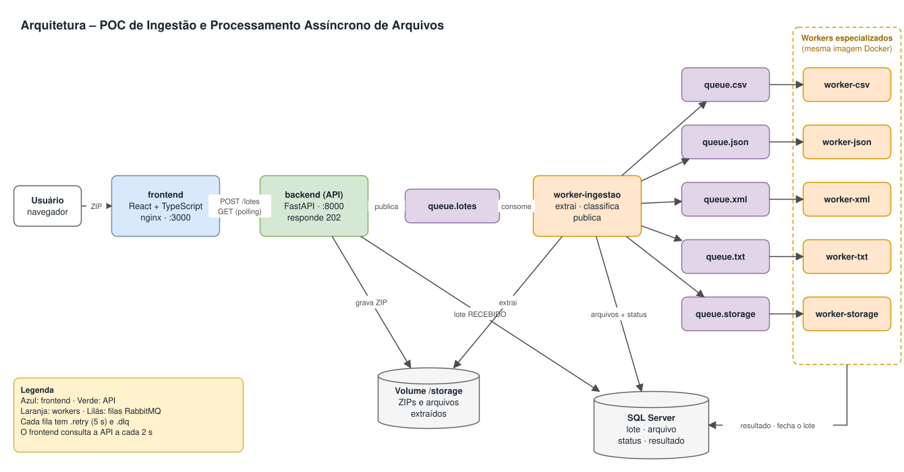
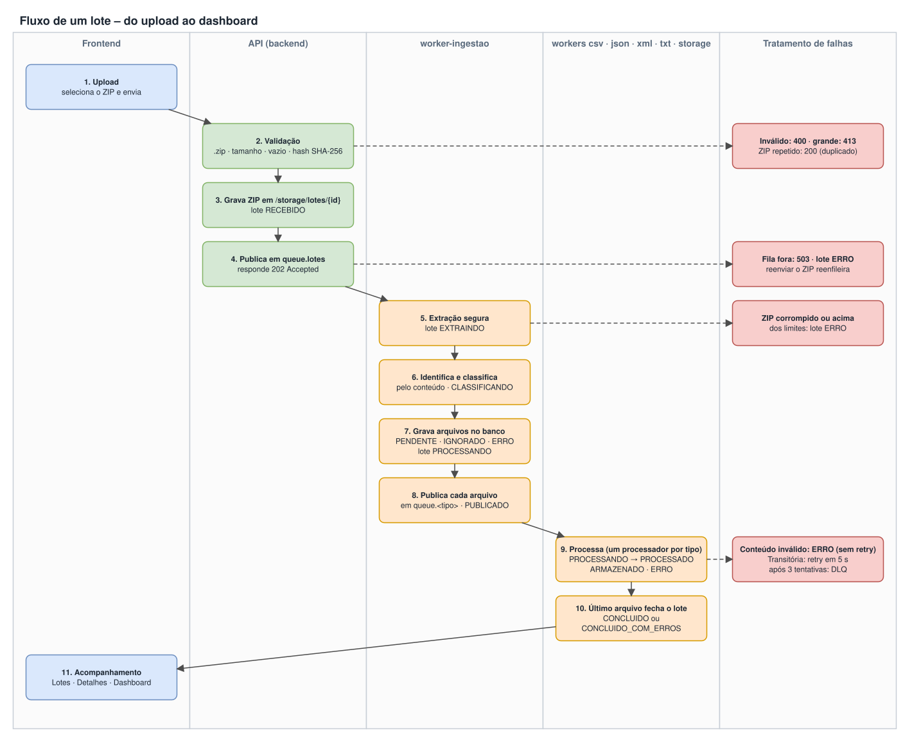
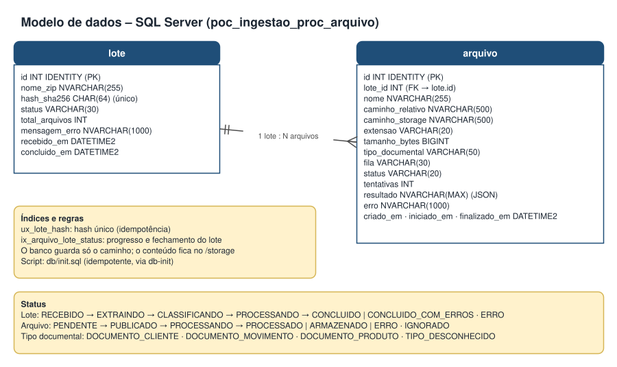

# POC — Sistema de Ingestão e Processamento Assíncrono de Arquivos

Recebe lotes compactados (ZIP), extrai os arquivos com segurança, classifica cada um **pelo conteúdo**, distribui em **filas independentes do RabbitMQ**, processa de forma **assíncrona** em workers especializados, grava os resultados no **SQL Server** e apresenta o acompanhamento em um **frontend React**.

> Todos os dados, layouts e classificações são fictícios.

**Sumário:** [Arquitetura](#arquitetura) · [Fluxo](#fluxo-de-um-lote) · [Tecnologias](#tecnologias) · [Estrutura](#estrutura-do-projeto) · [Como executar](#como-executar) · [Variáveis de ambiente](#variáveis-de-ambiente) · [Endpoints](#endpoints-da-api) · [Filas](#filas-do-rabbitmq) · [Modelo de dados](#modelo-de-dados) · [Arquivos de teste](#arquivos-de-teste) · [Decisões técnicas](#decisões-técnicas) · [Diferenciais](#diferenciais-implementados) · [Limitações](#limitações-conhecidas-e-melhorias-para-produção)

Detalhes de arquitetura, estados, mensageria, escalabilidade e como estender: **[docs/arquitetura.md](docs/arquitetura.md)**.
Os diagramas estão em [`docs/diagramas/`](docs/diagramas) no formato `.drawio.svg`: aparecem como imagem no GitHub e podem ser editados no [draw.io](https://app.diagrams.net) ou no VS Code (extensão *Draw.io Integration*).

---

## Arquitetura



- **API (backend):** só valida, grava o ZIP, registra o lote e publica em `queue.lotes`. Responde **202 Accepted** sem esperar o processamento.
- **worker-ingestao:** extrai o ZIP, identifica e classifica os arquivos, grava no banco e publica cada arquivo na fila do seu tipo.
- **Workers especializados:** um container por fila, todos com a **mesma imagem Docker** (muda só o argumento `--fila`). A falha de um arquivo não bloqueia os outros.
- **Banco:** guarda lote, arquivos, status, resultado e só o **caminho** de cada arquivo; o conteúdo fica no volume `/storage`.

## Fluxo de um lote



Mensagem publicada para cada arquivo (só o necessário para localizá-lo, nunca o conteúdo):

```json
{ "arquivoId": 100, "loteId": 15, "caminho": "/storage/lotes/15/extraidos/documento.xml",
  "tipo": "DOCUMENTO_MOVIMENTO", "tentativa": 1 }
```

## Tecnologias

| Camada | Tecnologia |
|---|---|
| Backend e workers | Python 3.12, FastAPI, SQLAlchemy 2, pyodbc (ODBC Driver 18), pika |
| Banco de dados | SQL Server 2022 (Express) |
| Mensageria | RabbitMQ 3 (com painel de gerenciamento) |
| Frontend | React 18 + TypeScript + Vite, servido por nginx |
| Infraestrutura | Docker + Docker Compose |
| Versionamento | Git |

## Estrutura do projeto

```
certacon/
├── docker-compose.yml        # todos os containers
├── .env.example              # modelo de variáveis (sem credenciais reais)
├── 1_recompilar.bat          # Windows: só compila as imagens
├── 2_inicio_docker_urls.bat  # Windows: abre o Docker, sobe tudo e abre o Painel
├── db/init.sql               # criação do banco, tabelas e índices
├── docs/arquitetura.md       # detalhes técnicos
├── samples/                  # ZIPs fictícios de teste + gerador
├── backend/
│   ├── Dockerfile            # uma imagem para a API e todos os workers
│   └── app/
│       ├── main.py           # API FastAPI (rotas, CORS, erros → HTTP)
│       ├── config.py         # configurações lidas do ambiente
│       ├── api/              # endpoints: lotes, dashboard, health
│       ├── domain/           # status, tipos documentais, extensão → fila, erros de negócio
│       ├── ingestion/        # recebimento (API), extração segura, ingestão (worker-ingestao)
│       ├── classifiers/      # regras de classificação pelo conteúdo (Strategy) + registro
│       ├── processors/       # um processador por tipo (Strategy) + registro (Factory)
│       ├── processing/       # caso de uso "processar um arquivo" (workers de tipo)
│       ├── workers/          # loop de consumo genérico (ack, retry, DLQ) + ponto de entrada
│       ├── infrastructure/   # banco, repositórios, consultas, RabbitMQ, filas, storage
│       └── manutencao/       # política de retenção do storage
└── frontend/
    ├── Dockerfile            # build do Vite + nginx
    └── src/
        ├── api.ts            # cliente da API e tipos
        ├── usePolling.ts     # consulta periódica
        └── pages/            # Painel, Upload, Lotes, LoteDetalhe, Dashboard
```

## Como executar

**Pré-requisito:** Docker Desktop (ou Docker Engine + Compose).

```bash
cp .env.example .env          # no Windows: copy .env.example .env
docker compose up --build
```

Na primeira vez o SQL Server leva 1–2 minutos para subir; o `db-init` cria o banco e os demais containers esperam por ele (health checks). Os comandos devem ser executados **na raiz do projeto** (onde está o `.env`).

No Windows também há dois atalhos:

| Arquivo | Quando usar |
|---|---|
| `1_recompilar.bat` | Depois de mudar o código: **só compila** as imagens (`docker compose build`), sem subir containers. |
| `2_inicio_docker_urls.bat` | Abre o Docker Desktop se estiver fechado, sobe os containers (recriando os que têm imagem nova), espera a API e abre o Painel. |

### Endereços

| O quê | URL |
|---|---|
| **Painel** (links para tudo e situação dos serviços) | http://localhost:3000/#/painel |
| Frontend – Upload / Lotes / Dashboard | http://localhost:3000 |
| Swagger / ReDoc | http://localhost:8000/docs · http://localhost:8000/redoc |
| RabbitMQ (usuário e senha do `.env`) | http://localhost:15672 |
| SQL Server (ex.: VS Code, DBeaver) | `localhost,14330` – usuário `sa` |

### Comandos úteis

```bash
docker compose ps                                  # situação dos containers
docker compose logs -f worker-csv                  # logs de um worker
docker compose up -d --scale worker-csv=3          # 3 réplicas do worker de CSV
docker compose stop rabbitmq                       # simular queda da fila
docker compose cp backend:/storage/lotes/1 ./lote-1  # copiar os arquivos de um lote
docker compose exec backend python -m app.manutencao.retencao --simular  # retenção (só lista)
docker compose down                                # parar (mantém os dados)
docker compose down -v                             # parar e APAGAR banco, filas e arquivos
```

## Variáveis de ambiente

Definidas no `.env` (modelo em `.env.example`). Nenhuma credencial fica no código.

| Variável | Padrão | Descrição |
|---|---|---|
| `DB_USER` / `DB_PASSWORD` | `sa` / – | Login do SQL Server. A senha precisa seguir a política do SQL Server (8+ caracteres, maiúsculas, minúsculas e números/símbolos). |
| `DB_NAME` | `poc_ingestao_proc_arquivo` | Nome do banco |
| `RABBIT_USER` / `RABBIT_PASSWORD` | – | Login do RabbitMQ (também usado no painel :15672) |
| `STORAGE_PATH` | `/storage` | Pasta do volume compartilhado |
| `MAX_ZIP_MB` | `100` | Tamanho máximo do ZIP enviado |
| `MAX_ARQUIVOS_POR_LOTE` | `500` | Quantidade máxima de arquivos dentro do ZIP |
| `MAX_DESCOMPACTADO_MB` | `500` | Tamanho máximo descompactado (proteção contra ZIP bomb) |
| `MAX_TENTATIVAS` | `3` | Tentativas por mensagem antes de ir para a DLQ |
| `RETENCAO_DIAS` | `30` | Idade a partir da qual a retenção apaga os arquivos de lotes finalizados |

`DB_HOST` e `RABBIT_HOST` são definidos pelo `docker-compose.yml` (nomes dos serviços).

## Endpoints da API

Documentação interativa em **/docs** (Swagger).

| Método | Rota | Descrição |
|---|---|---|
| `POST` | `/lotes` | Envia um ZIP (`multipart/form-data`, campo `arquivo`). **202** com `loteId`; **200** com `duplicado: true` se o mesmo ZIP já foi enviado; **400** arquivo inválido; **413** acima do limite; **503** fila indisponível. |
| `GET` | `/lotes?pagina=1&tamanho=20&status=` | Lista paginada, mais recentes primeiro, com filtro por status e contagens por lote |
| `GET` | `/lotes/{id}` | Detalhes: progresso (%), contagens e todos os arquivos (extensão, tipo, fila, status, tentativas, tempo, erro, resultado) |
| `GET` | `/lotes/{id}/zip` | Download do ZIP original |
| `GET` | `/lotes/{id}/arquivos/{arquivoId}/download` | Download de um arquivo extraído (sem alteração) |
| `GET` | `/dashboard` | Arquivos por extensão, tipo e status; tempo médio (geral, por fila e por lote); lotes por situação |
| `GET` | `/health` | Situação da API, do SQL Server e do RabbitMQ (**503** se algum estiver fora) |

Exemplo:

```bash
curl -F "arquivo=@samples/lote-valido.zip" http://localhost:8000/lotes
curl http://localhost:8000/lotes/1
```

## Filas do RabbitMQ

Criadas pelo próprio código quando a API e os workers sobem (declaração idempotente), a partir do mapeamento extensão → fila em `domain/tipos.py`.

| Fila | Worker | Conteúdo |
|---|---|---|
| `queue.lotes` | worker-ingestao | Lotes recebidos (extração e classificação) |
| `queue.csv` | worker-csv | Arquivos `.csv` |
| `queue.json` | worker-json | Arquivos `.json` |
| `queue.xml` | worker-xml | Arquivos `.xml` |
| `queue.txt` | worker-txt | Arquivos `.txt` |
| `queue.storage` | worker-storage | `.pdf`, `.jpg`, `.jpeg`, `.png` (só armazenar) |

Cada fila principal tem duas auxiliares:

- `queue.<tipo>.retry` — espera 5 s (TTL) e devolve a mensagem para a fila principal (*retry com atraso*).
- `queue.<tipo>.dlq` — *dead letter queue*: mensagens que esgotaram as tentativas ou são ilegíveis.

Garantias: filas e mensagens **duráveis**, **confirmação de publicação** (publisher confirms + `mandatory`), **ack manual** só depois de gravar no banco, `prefetch_count=1`, reconexão automática com espera crescente. Detalhes em [docs/arquitetura.md](docs/arquitetura.md#mensageria).

## Modelo de dados



Script: [`db/init.sql`](db/init.sql) (idempotente; executado pelo container `db-init`).

### Status

| Entidade | Fluxo |
|---|---|
| Lote | `RECEBIDO → EXTRAINDO → CLASSIFICANDO → PROCESSANDO → CONCLUIDO \| CONCLUIDO_COM_ERROS`; `ERRO` se a falha impede o recebimento ou a extração |
| Arquivo | `PENDENTE → PUBLICADO → PROCESSANDO → PROCESSADO \| ARMAZENADO \| ERRO`; `IGNORADO` (extensão não suportada ou arquivo vazio) e `ERRO` (não extraído) já na ingestão |

### Tipos e classificação

| Extensão | Processa? | Fila | Classificação (pelo conteúdo) |
|---|---|---|---|
| CSV | Sim | queue.csv | colunas `cliente_id` e `documento` → `DOCUMENTO_CLIENTE` |
| JSON | Sim | queue.json | propriedade `products` → `DOCUMENTO_PRODUTO` |
| XML | Sim | queue.xml | raiz `<clientes>` → `DOCUMENTO_CLIENTE`; raiz `<movimentos>` → `DOCUMENTO_MOVIMENTO` |
| TXT | Sim | queue.txt | primeira linha começa com `MOV\|` → `DOCUMENTO_MOVIMENTO` |
| PDF, JPG/JPEG, PNG | Não | queue.storage | – (só metadados, status `ARMAZENADO`) |
| Outras | – | – | `IGNORADO`, sem interromper o lote |

Sem correspondência: `TIPO_DESCONHECIDO`.

### Resultado do processamento (coluna `resultado`)

| Tipo | Campos |
|---|---|
| CSV | `delimitador`, `linhas`, `colunas`, `nomesColunas` (erro se uma linha tiver nº de colunas diferente do cabeçalho) |
| JSON | `estrutura` (objeto/lista), `elementosPrimeiroNivel`, `chaves` |
| XML | `elementoRaiz`, `quantidadeElementos` (leitura em streaming; sem XSD) |
| TXT | `linhas`, `primeiraLinha`, `padraoPrimeiraLinha` |
| PDF/imagem | `tamanhoBytes`, `tipoMime`, `sha256`, `caminhoArmazenado` |

Todos incluem `tipoDocumental`.

## Arquivos de teste

Em [`samples/`](samples/README.md) — todos fictícios. Para gerar de novo: `python samples/gerar_samples.py`.

| ZIP | Demonstra | Lote termina |
|---|---|---|
| `lote-valido.zip` | Um arquivo válido de cada tipo e todas as classificações | `CONCLUIDO` |
| `lote-com-erros.zip` | CSV, JSON e XML inválidos, arquivo vazio, nome duplicado, `../` | `CONCLUIDO_COM_ERROS` |
| `lote-com-arquivos-nao-processaveis.zip` | PDF e imagens armazenados; `.xlsx`, `.exe` e arquivo sem extensão ignorados | `CONCLUIDO` |
| `lote-corrompido.zip` | ZIP inválido | `ERRO` |
| `lote-1mb.zip` | Volume (~1 MB por arquivo) | `CONCLUIDO` |

O resultado esperado de cada arquivo está em [`samples/README.md`](samples/README.md).

## Decisões técnicas

| Decisão | Motivo |
|---|---|
| **Python + FastAPI** | Menos código para o mesmo resultado, Swagger automático, injeção de dependência nativa (`Depends`). |
| **Extração em worker (`queue.lotes`), não na API** | O upload responde rápido e um ZIP grande não prende a API; a extração ganha retry e DLQ como qualquer outra etapa. |
| **Uma imagem para API e todos os workers** | Mesmo código e mesmas dependências; cada container muda só o comando (`--fila`). Simples de construir e de escalar. |
| **Um banco, não um por serviço** | Lote e arquivos são o mesmo contexto e precisam de consistência (ex.: fechar o lote). A separação de responsabilidades está no código (camadas, Strategy, Factory), não no banco. |
| **Classificação na ingestão; processamento no worker** | A fila e o tipo documental são decididos uma vez e vão na mensagem; o worker só processa. |
| **Mensagem pequena (só ids e caminho)** | O conteúdo fica no volume; a mensagem não pesa na fila e não expõe dados. |
| **Retry com fila de atraso (TTL) + DLQ** | Falha transitória (banco ou fila fora) tenta de novo depois de 5 s, até `MAX_TENTATIVAS`; erro de conteúdo (`ErroPermanente`) vai direto para ERRO, sem retry inútil. |
| **Fechamento do lote com um `UPDATE` atômico** | Vários workers terminam ao mesmo tempo; só o último consegue mudar o status (sem *race condition* e sem lock explícito). |
| **Idempotência por SHA-256 do ZIP** | Reenviar o mesmo ZIP devolve o lote existente (200, `duplicado`). Mensagens repetidas são ignoradas pelo status (entrega "pelo menos uma vez"). Exceção: lote que falhou só por fila indisponível é reenfileirado ao reenviar o ZIP. |
| **Polling no frontend** | Atende o requisito com simplicidade; para quando o lote termina. |

## Diferenciais implementados

- **Confiabilidade:** retry com atraso, DLQ, backoff na reconexão, idempotência (hash do ZIP + status), retomada de lote interrompido, reenfileiramento após queda da fila.
- **Arquitetura:** camadas (api / domain / ingestion / processing / infrastructure), Strategy (classificadores e processadores), Factory (registro de processadores e de workers), injeção de dependência.
- **Operação:** health checks (SQL Server, RabbitMQ e API — esta checa banco e fila), logs com correlação (`loteId`, `arquivoId`, `fila`, `worker`), política de retenção do storage.
- **Experiência:** Painel com situação dos serviços, paginação e filtro por status, progresso do upload, atualização automática, download do ZIP original e de cada arquivo extraído.
- **Segurança:** path traversal, ZIP bomb (limite conferido nos bytes realmente escritos), ZIP com senha, ZIP corrompido, nomes duplicados, arquivos vazios; downloads só de dentro do `/storage`.

## Limitações conhecidas e melhorias para produção

| Limitação | Em produção |
|---|---|
| Sem testes automatizados, lint ou CI | pytest (unitários dos classificadores/processadores com arquivos de exemplo; integração com Testcontainers), ruff, GitHub Actions |
| ZIP aninhado (bônus) não implementado: um `.zip` dentro do lote fica `IGNORADO` | Extração recursiva com limite de profundidade e origem registrada |
| Logs em texto | Logs estruturados (JSON) enviados para ELK/Loki; métricas (Prometheus) e tracing |
| Publicação da API abre uma conexão por mensagem | Pool de conexões/canais |
| Retenção executada manualmente (`app.manutencao.retencao`) | Agendamento (cron / CronJob) |
| Storage em volume local | Object storage (S3, Azure Blob) |
| Atualização por polling | Server-Sent Events ou WebSocket |
| Sem autenticação (fora do escopo da POC) | OAuth2/JWT na API |
| Reprocessar mensagens da DLQ é manual (painel do RabbitMQ) | Endpoint/rotina de reprocessamento |
