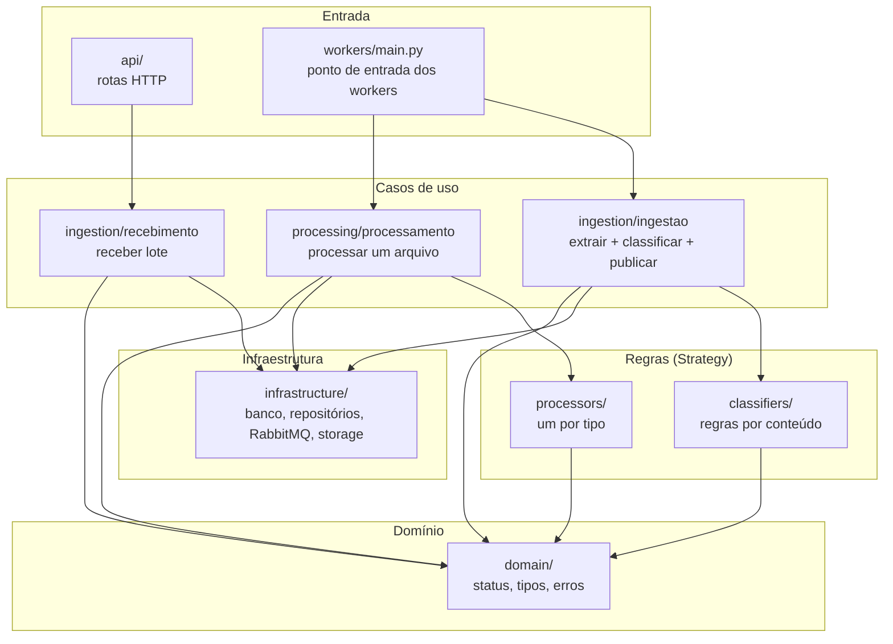
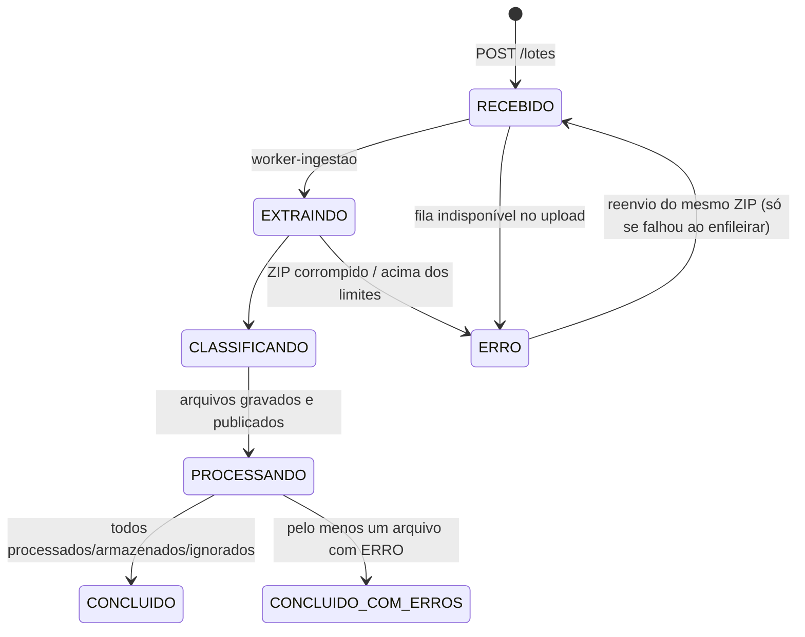
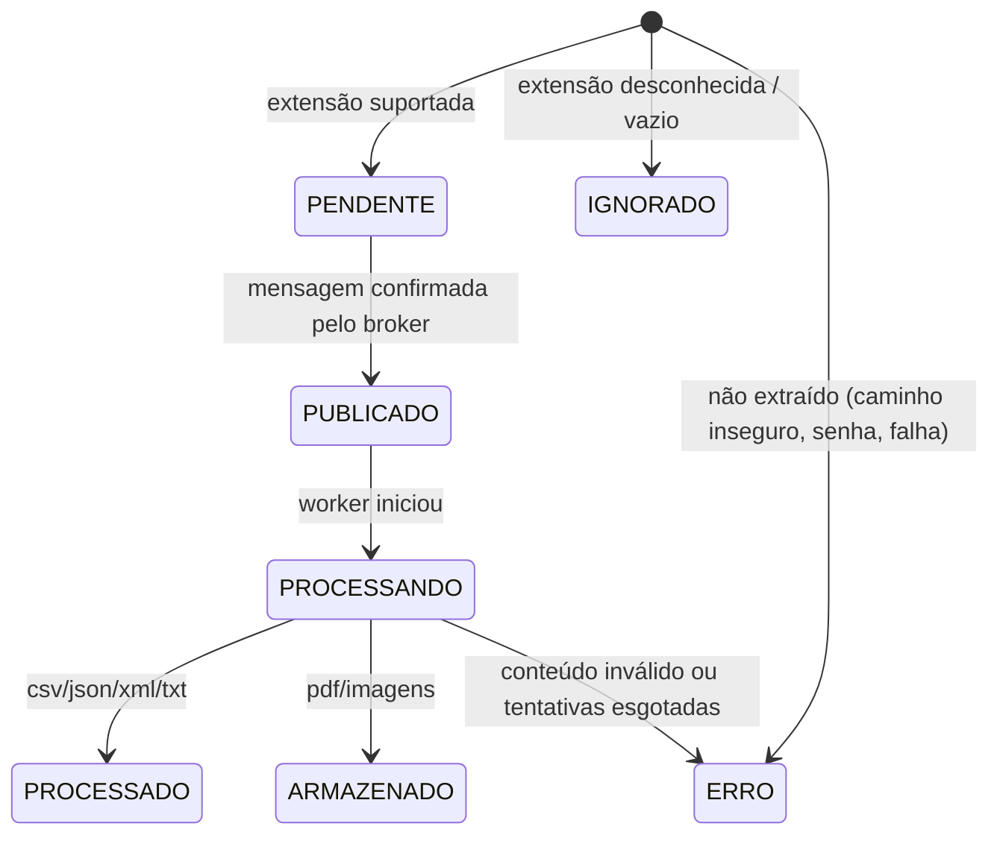

# Arquitetura — detalhes técnicos

Complemento do [README](../README.md). Explica as camadas, os estados, a mensageria, o tratamento de erros, a escalabilidade e como estender a solução.

## 1. Camadas e responsabilidades



| Pasta | Responsabilidade | Não faz |
|---|---|---|
| `api/` | Traduz HTTP ↔ casos de uso; erros de negócio → código HTTP (`main.py`) | Regra de negócio |
| `domain/` | Status, tipos documentais, mapeamento extensão → fila, erros de negócio | Acesso a banco, fila ou disco |
| `ingestion/` | Receber lote (API) e ingerir lote (worker-ingestao) | Processar conteúdo dos arquivos |
| `classifiers/` | Decidir o tipo documental lendo o conteúdo | Saber de filas ou banco |
| `processors/` | Extrair as informações de um tipo de arquivo | Saber de filas ou banco |
| `processing/` | Orquestrar o processamento de um arquivo (status, resultado, fechar lote) | Saber o formato do arquivo |
| `workers/` | Loop de consumo genérico: ack, retry, DLQ, reconexão | Regra de negócio |
| `infrastructure/` | SQL Server, repositórios, consultas, RabbitMQ, topologia, storage | Regra de negócio |

Os casos de uso recebem as dependências pelo construtor (storage, publisher, sessão, processador). Na API isso é montado com `Depends` do FastAPI; nos workers, pelas funções de fábrica em `workers/main.py`.

### Princípios SOLID aplicados

- **S — Responsabilidade única:** cada regra de classificação e cada processador é uma classe; extração, classificação, publicação e processamento são passos separados.
- **O — Aberto/fechado:** um tipo novo de arquivo entra **acrescentando** classes e registros; o fluxo de ingestão, o consumidor e o processamento não mudam (ver [seção 7](#7-como-estender)).
- **L — Substituição de Liskov:** qualquer processador pode ser usado no lugar de outro pelo caso de uso `ProcessamentoDeArquivo`.
- **I — Segregação de interfaces:** contratos pequenos — `Classificador.classificar()`, `Processador.processar()` + `status_sucesso`.
- **D — Inversão de dependência:** casos de uso dependem de contratos (publisher, storage, sessão) recebidos pelo construtor, não de implementações concretas — por isso podem ser testados com versões falsas.

## 2. Estados

### Lote



### Arquivo



`IDENTIFICADO` existe no enum, mas o arquivo já nasce no estado decidido pela ingestão (gravação única, com todos os arquivos do lote numa transação).

## 3. Mensageria

### Topologia

```
exchange "ingestao" (direct) ──routing key = tipo──▶ queue.<tipo>
queue.<tipo>  ──nack / x-dead-letter──▶ exchange "ingestao.dlx" ──▶ queue.<tipo>.dlq
worker ──publica (falha transitória)──▶ queue.<tipo>.retry ──TTL 5 s──▶ exchange "ingestao" ──▶ queue.<tipo>
```

Tipos: `lotes` + os destinos de `domain/tipos.FILA_POR_EXTENSAO` (`csv`, `json`, `xml`, `txt`, `storage`) → 6 filas principais × 3 = 18 filas. A declaração está em `infrastructure/topology.py` e roda quando a API e cada worker sobem.

### Garantias

| Requisito | Como |
|---|---|
| Confirmação de consumo | Ack manual (`basic_ack`) só depois de gravar o resultado no banco |
| Confirmação de publicação | `confirm_delivery()` + `mandatory=True`: a publicação falha se o broker não confirmar ou se nenhuma fila receber |
| Prevenção de perda | Exchanges e filas `durable`, mensagens `delivery_mode=2` (persistentes); se o worker cair antes do ack, o RabbitMQ entrega de novo |
| Falhas e mensagens não processadas | Retry com atraso → DLQ após `MAX_TENTATIVAS`; mensagem ilegível vai direto para a DLQ |
| Consumo concorrente | `prefetch_count=1` + réplicas do worker (`--scale`): o RabbitMQ distribui as mensagens entre os consumidores |
| Mensagens repetidas | O status no banco torna o processamento idempotente: arquivo já finalizado é ignorado; lote finalizado também |

### Tratamento de erros no consumidor (`workers/consumidor.py`)

| Situação | Ação | Status |
|---|---|---|
| Sucesso | ack | PROCESSADO / ARMAZENADO |
| `ErroPermanente` (JSON inválido, XML malformado, arquivo inexistente...) | grava o erro, ack (sem retry: repetir não resolve) | ERRO |
| Outra exceção (banco fora, timeout...) e `tentativa < MAX_TENTATIVAS` | publica em `.retry` com `tentativa+1`, ack | continua PROCESSANDO |
| Outra exceção na última tentativa | grava o erro, nack → DLQ | ERRO |
| RabbitMQ cai | reconexão com espera 1, 2, 4... até 30 s | – |

A cada arquivo finalizado (com sucesso ou erro), o caso de uso tenta fechar o lote com um `UPDATE` condicional atômico; só o último arquivo consegue.

## 4. Segurança e robustez

| Risco | Tratamento | Onde |
|---|---|---|
| Path traversal (`../`, caminho absoluto, `C:`) | Arquivo não é gravado; status ERRO | `ingestion/extracao.py` |
| ZIP bomb | Limite de quantidade e de tamanho descompactado, conferido nos bytes realmente escritos (o cabeçalho do ZIP pode mentir) | `extracao.py` |
| ZIP grande | `MAX_ZIP_MB`, lido em blocos de 1 MB (nunca inteiro na memória) → 413 | `infrastructure/storage.py` |
| ZIP corrompido | Lote ERRO com mensagem | `extracao.py` |
| ZIP com senha | Arquivo ERRO, o resto do lote segue | `extracao.py` |
| Nomes duplicados (inclusive só maiúsc./minúsc.) | Sufixo `_1`, `_2`... | `extracao.py` |
| Arquivo vazio | IGNORADO | `ingestion/ingestao.py` |
| Extensão não suportada | IGNORADO; lote não é interrompido | `ingestao.py` |
| Caminho adulterado na mensagem / no download | Só aceita caminhos dentro do `/storage` | `processamento.py`, `ingestao.py`, `storage.py` |
| RabbitMQ fora no upload | 503; lote ERRO "Falha ao enfileirar"; reenviar o mesmo ZIP reenfileira | `recebimento.py` |
| RabbitMQ ou banco fora no worker | Retry com atraso; reconexão automática | `consumidor.py` |
| Worker cai no meio do lote | Mensagem volta para a fila; ingestão retoma publicando só os pendentes | `ingestao.py` |
| Retenção | `python -m app.manutencao.retencao` apaga do storage lotes finalizados há mais de `RETENCAO_DIAS` (banco mantido) | `manutencao/retencao.py` |
| Credenciais | Só no `.env` (fora do Git); `.env.example` com valores de exemplo | – |

## 5. Logs

Formato: `data nível worker=<worker-fila@container> módulo mensagem chave=valor`. Todas as linhas de processamento têm `loteId` e, quando há, `arquivoId` e `fila`. O conteúdo dos arquivos nunca é registrado.

| Evento | Exemplo |
|---|---|
| Recebimento do lote | `Lote recebido loteId=7 nome=lote-valido.zip bytes=2310` |
| Publicação do lote | `Lote publicado loteId=7 fila=queue.lotes` |
| Início e fim da extração | `Início da extração loteId=7` · `Fim da extração loteId=7 arquivos=7` |
| Identificação e classificação | `Arquivo identificado loteId=7 arquivoId=31 arquivo=clientes.csv extensao=csv status=PENDENTE fila=queue.csv tipo=DOCUMENTO_CLIENTE` |
| Publicação na fila | `Arquivo publicado loteId=7 arquivoId=31 fila=queue.csv tipo=DOCUMENTO_CLIENTE` |
| Início e fim do processamento | `Início do processamento loteId=7 arquivoId=31 tentativa=1` · `Fim do processamento ... status=PROCESSADO` |
| Reprocessamento | `Falha transitória, agendando retry fila=queue.csv loteId=7 arquivoId=31 tentativa=1 motivo=...` |
| Erros | `Erro permanente, sem retry ...` · `Tentativas esgotadas, enviando para a DLQ ...` |
| Fechamento | `Lote finalizado loteId=7` |

## 6. Escalabilidade

- **Mais workers de um tipo:** `docker compose up -d --scale worker-csv=3`. Não há `container_name` fixo; com `prefetch_count=1`, o RabbitMQ entrega uma mensagem por vez a cada réplica. O fechamento do lote é atômico, então réplicas concorrentes não geram inconsistência.
- **Tipos independentes:** um pico de CSV não atrasa XML, porque cada tipo tem sua fila e seus workers.
- **API sem estado:** pode ter várias réplicas atrás de um balanceador (o estado está no banco, na fila e no volume).
- **Gargalos conhecidos:** volume local compartilhado (em produção, object storage) e uma conexão por publicação na API (em produção, pool).

## 7. Como estender

### Nova regra de classificação

1. Criar a classe em `classifiers/regras.py` com `classificar(extensao, caminho) -> str | None`.
2. Acrescentá-la em `CLASSIFICADORES` (`classifiers/registry.py`).

O fluxo de ingestão não muda.

### Novo tipo de arquivo (ex.: XLSX)

| Passo | Arquivo | O que fazer |
|---|---|---|
| 1 | `domain/tipos.py` | `"xlsx": "xlsx"` em `FILA_POR_EXTENSAO` e `"xlsx"` em `EXTENSOES_PROCESSAVEIS` — as filas `queue.xlsx`, `.retry` e `.dlq` passam a ser criadas sozinhas |
| 2 | `processors/xlsx_processor.py` | Classe com `status_sucesso` e `processar(caminho) -> dict` |
| 3 | `processors/registry.py` | `"xlsx": XlsxProcessor` em `PROCESSADORES` — o worker `--fila xlsx` passa a existir |
| 4 | `classifiers/regras.py` + `registry.py` | (opcional) regra de classificação para o conteúdo |
| 5 | `docker-compose.yml` | Serviço `worker-xlsx` com `command: python -m app.workers.main --fila xlsx` |
| 6 | `requirements.txt` | Biblioteca de leitura (ex.: `openpyxl`) |

Nada muda em `ingestao.py`, `consumidor.py`, `processamento.py`, na API ou no frontend.
