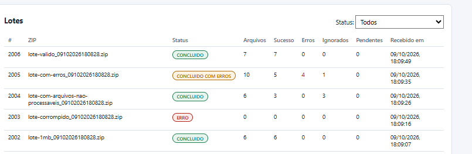
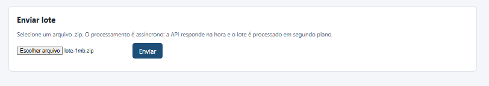

# Evidências de Testes

Execução manual em ambiente local (Windows + Docker Desktop), entre **07 e 09/10/2026**, com os ZIPs de [`exemplos/`](../../exemplos/README.md).
O mesmo fluxo é repetido automaticamente a cada push pelo [CI](../../.github/workflows/ci.yml) (teste de ponta a ponta).

## Resumo

| # | Evidência | O que comprova | Resultado |
|---|---|---|---|
| 01 | [Lista de lotes](#01--lista-de-lotes) | Status final de cada cenário de teste | ✅ |
| 02 | [Upload](#02--upload) | Tela de envio do ZIP (processamento assíncrono) | ✅ |
| 03 | [Dashboard](#03--dashboard) | Indicadores por extensão, tipo e status; tempos médios | ✅ |
| 04 | [RabbitMQ – filas](#04--rabbitmq--filas) | 18 filas duráveis criadas pelo código (principal, retry e DLQ por tipo) | ✅ |
| 05 | [RabbitMQ – visão geral](#05--rabbitmq--visão-geral) | 6 consumidores (um por worker), nenhuma mensagem perdida | ✅ |
| 06 | [Swagger](#06--swagger) | Endpoints da API documentados | ✅ |
| 07 | [Storage](#07--storage-volume-docker) | ZIP original e arquivos extraídos em `/storage/lotes/{loteId}/` | ✅ |
| 08 | [Detalhe do lote](#08--detalhe-do-lote-lote-1mbzip) | Progresso, tipo, fila, status, tentativas, tempo e download por arquivo | ✅ |

---

## 01 – Lista de lotes

Cada ZIP de teste terminou no status esperado (ver [`exemplos/README.md`](../../exemplos/README.md)):

| Lote | ZIP | Esperado | Obtido | Arquivos (sucesso / erros / ignorados) |
|---|---|---|---|---|
| 1 | `lote-1mb.zip` | CONCLUIDO | ✅ CONCLUIDO | 6 (6 / 0 / 0) |
| 2 | `lote-valido.zip` | CONCLUIDO | ✅ CONCLUIDO | 7 (7 / 0 / 0) |
| 3 | `lote-corrompido.zip` | ERRO | ✅ ERRO | 0 – ZIP inválido, nenhum arquivo extraído |
| 4 | `lote-com-erros.zip` | CONCLUIDO_COM_ERROS | ✅ CONCLUIDO_COM_ERROS | 10 (5 / 4 / 1) – CSV, JSON e XML inválidos + `../` (ERRO); vazio (IGNORADO) |
| 5 | `lote-com-arquivos-nao-processaveis.zip` | CONCLUIDO | ✅ CONCLUIDO | 6 (3 armazenados / 0 / 3) – `.xlsx`, `.exe` e sem extensão ignorados |
| 6 | `lote-1mb - 2.zip` (variação do lote-1mb) | CONCLUIDO | ✅ CONCLUIDO | 6 (6 / 0 / 0) – bytes diferentes do lote 1, por isso não foi tratado como duplicado |
| 1002, 1003 | lotes gerados com `--carimbo` | CONCLUIDO | ✅ CONCLUIDO | lotes inéditos (nomes com data e hora), não caem na regra de duplicidade |

Também visível: paginação e filtro por status.

## 02 – Upload

Seleção do ZIP e envio. A API responde **202** na hora e o processamento segue em segundo plano.

## 03 – Dashboard

- **Lotes:** 8 no total — 6 concluídos, 1 concluído com erros, 1 com erro, 0 em andamento (bate com a evidência 01).
- **Arquivos por extensão, tipo documental e status:** 30 PROCESSADO, 10 ARMAZENADO, 4 ERRO, 4 IGNORADO.
- **Tempos médios:** por arquivo e por fila (`queue.csv`, `queue.json`, `queue.storage`, `queue.txt`, `queue.xml`).
  O tempo médio **por lote** inclui lotes enviados durante o desenvolvimento, quando os workers ficaram parados de propósito (ex.: lote 1, recebido às 19:44 e concluído às 22:49 — evidência 08), por isso é bem maior que o tempo por arquivo.
- `NAO_CLASSIFICADO` = arquivos sem análise de conteúdo (PDF, imagens, ignorados), que não recebem tipo documental.

## 04 – RabbitMQ – filas

- **18 filas** = 6 tipos (`lotes`, `csv`, `json`, `xml`, `txt`, `storage`) × 3 (principal, `.retry`, `.dlq`), criadas pelo próprio código ao subir.
- **D** = durável (sobrevive a reinício do RabbitMQ); **DLX/DLK** = mensagens rejeitadas vão para a DLQ; **TTL** nas `.retry` = espera de 5 s antes de nova tentativa.
- Todas com 0 mensagens: tudo foi consumido e confirmado (ack).

## 05 – RabbitMQ – visão geral

- **Consumers: 6** — um por worker (`worker-ingestao`, `worker-csv`, `worker-json`, `worker-xml`, `worker-txt`, `worker-storage`).
- **Queues: 18**, **Exchanges** incluindo `ingestao` e `ingestao.dlx`.
- Fila vazia (Ready 0 / Unacked 0): nenhuma mensagem pendente ou perdida.

## 06 – Swagger

Endpoints: `GET /health`, `POST /lotes`, `GET /lotes`, `GET /lotes/{id}`, `GET /lotes/{id}/zip`, `GET /lotes/{id}/arquivos/{arquivoId}/download`, `GET /dashboard`.

## 07 – Storage (volume Docker)

Volume `certacon_storage`, compartilhado pela API e pelos workers:
`/storage/lotes/1/lote-1mb.zip` (ZIP original, como foi enviado) e `/storage/lotes/1/extraidos/` (arquivos extraídos, mantendo as subpastas, ex.: `imagens/`).
O banco guarda só o caminho de cada arquivo.

## 08 – Detalhe do lote (`lote-1mb.zip`)

- Progresso 100%, 6 arquivos de ~1 MB, todos com sucesso.
- Classificação pelo conteúdo: `clientes.csv` e `clientes.xml` → DOCUMENTO_CLIENTE; `movimentos.xml` e `movimentos.txt` → DOCUMENTO_MOVIMENTO; `produtos.json` → DOCUMENTO_PRODUTO.
- Cada arquivo na fila do seu tipo; a imagem foi para `queue.storage` e ficou **ARMAZENADO**.
- Tentativas, tempo de processamento e links de download (arquivo extraído e ZIP original).
